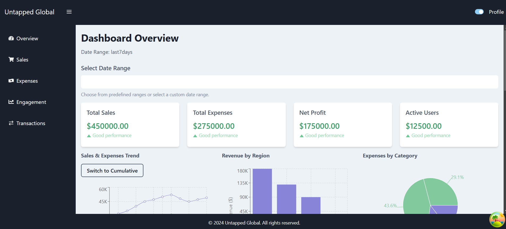
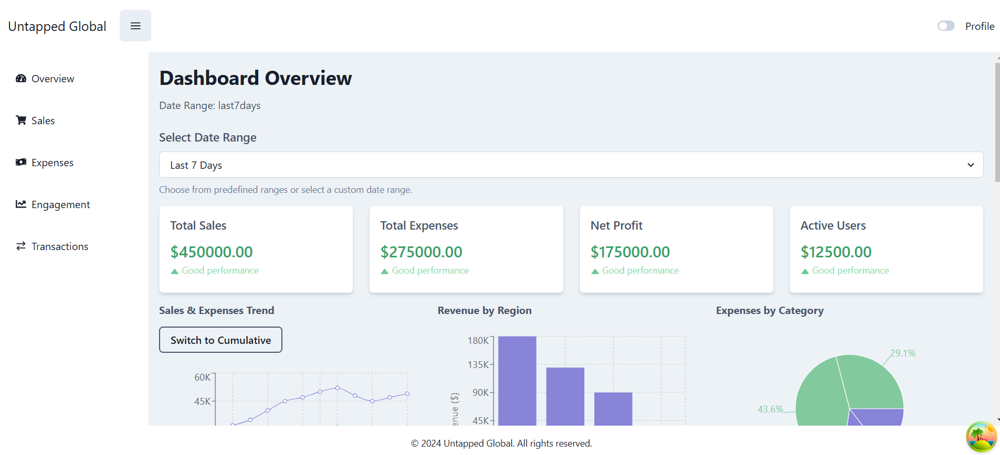
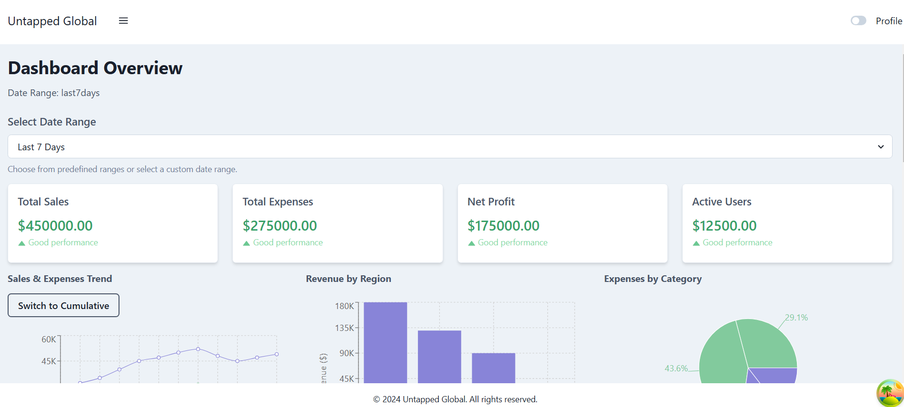

# Dashboard Application

A responsive and interactive dashboard built with React, Tailwind CSS, Chakra UI, Recharts, and React Query. This dashboard includes features such as data visualization with charts, and theme support for both light and dark modes.

## Overview

- <strong>Screenshot 1</strong>

- <strong>Screenshot 2</strong>

- <strong>Screenshot 1</strong>

## Tools/Programs Required

Before you begin, make sure you have the following installed:

1. Node.js (v14 or above): Install Node.js
2. npm (Node Package Manager) – comes with Node.js, used for managing dependencies.
3. Git: Install Git
4. JSON-Server (globally installed)

## Tools/Libraries Used

1. React/Next.js: A JavaScript library for building user interfaces.
2. React Query: For data fetching, caching, and synchronization.
3. Tailwind CSS: A utility-first CSS framework for styling.
4. Chakra UI: A component library for building accessible and reusable components.
4. Recharts: A charting library for data visualization.

## Setup Instructions

- Clone the Repository: `git clone git@github.com:rOluochKe/untapped.git`
- Navigate to the Project Directory: `cd untapped`
- Install Dependencies: `npm install`
- Run backend Server: `json-server --watch mock/db.json --port 3001`
- Run dev web client app: `npm run dev`

This will start the development server at `http://localhost:3000`, 
then you can view the application from `http://localhost:3000/dashboard/overview`.

## Features

1. Responsive Layout: Uses Tailwind CSS to ensure the dashboard works seamlessly on desktop and mobile devices.
2. Charts: Visualize sales, expenses, and other data using Recharts.
3. Dark Mode Support: Toggle between light and dark themes using Chakra UI’s built-in theming.
4. Data Fetching & Caching: Fetch and cache data using React Query.

## Thought Process

The goal of building this dashboard application was to create a user-friendly, responsive, and interactive tool for visualizing data. The core components included integrating data fetching mechanisms, handling dynamic chart visualizations, ensuring responsiveness across devices, and providing an intuitive UI with support for both light and dark modes.

### Choosing Libraries:

- React/NextJs was chosen for its flexibility and component-based architecture, making it easy to build reusable UI elements.
- React Query was used to handle data fetching, caching, and synchronization, which simplifies the API interaction and ensures efficient re-rendering of components.
- Tailwind CSS was used for styling because of its utility-first approach, enabling rapid prototyping and easy responsiveness management.
- Chakra UI was chosen to handle interactive components like modals, dropdowns, and tooltips, as it provides pre-built accessible components.
- Recharts was selected for data visualization due to its ease of use and flexibility for creating charts with dynamic datasets.

### Designing for Responsiveness:

- A mobile-first approach was adopted, ensuring the dashboard would work well on both small and large screens.
- Tailwind CSS played a significant role in ensuring that the layout adapts to different screen sizes without excessive custom CSS.

### Dark Mode:

- Chakra UI’s built-in theming system provided an easy way to toggle between light and dark modes. This ensured that the user could switch themes seamlessly without complex configurations

## Challenges Faced and How They Were Solved

### Data Fetching and Caching:

- Challenge: Managing data fetching and caching efficiently, especially with large datasets.
- Solution: React Query was used to handle data fetching, caching, and background refetching. This ensured that data was fetched once and cached for subsequent renders, improving the performance and minimizing unnecessary API calls.
- Future Consideration: For very large datasets, adding pagination or infinite scrolling could be beneficial.

### Chart Rendering and Performance:

- Challenge: Rendering large datasets in charts without affecting performance, especially as the chart size increases or the user interacts with it.
- Solution: Memoization of chart interactions were implemented to prevent excessive re-renders, making the application more responsive.
- Future Consideration: Further performance optimization can be done by using libraries like react-window for virtualizing large datasets.

### Responsiveness:

- Challenge: Ensuring the dashboard works on various screen sizes, including mobile devices.
- Solution: Tailwind CSS's utility classes for responsiveness (sm, md, lg, etc.) allowed for a flexible layout that adjusts seamlessly to different devices without writing complex media queries.
- Future Consideration: More mobile-first testing could be done to fine-tune UI elements for better touch interactions on mobile devices.

### Displaying Data in Tooltips:

- Challenge: The tooltip did not display data correctly on hover.
- Solution: Adjustments were made to ensure the tooltip correctly receives and displays the data by ensuring that the data structure passed to the tooltip component was correct and that event handlers properly captured the active data points.
- Future Consideration: Further customizations can be made to the tooltip’s appearance and behavior to make it more interactive, such as adding animations or styling.

### Handling Light/Dark Mode:

- Challenge: Implementing a dynamic theme switcher and ensuring that all components adapt to the selected theme.
- Solution: Chakra UI’s theming system was leveraged to manage light and dark themes effortlessly. The useColorMode hook allowed for toggling the theme dynamically, with component styling adapting automatically.
- Future Consideration: More customization can be added, such as saving the user’s theme preference in localStorage for a persistent experience across sessions.

## Future Improvements

### Real-time Data Updates:

- Implementing WebSockets or Server-Sent Events (SSE) to provide real-time data updates, especially useful for applications that require up-to-the-minute information (e.g., stock price dashboards, sales data).

### User Authentication:

- Adding authentication mechanisms (e.g., OAuth, JWT) to ensure that users can access personalized data, such as their sales data or region-specific information.

### Advanced Data Visualizations:

- Integrating more advanced charts or data visualizations like heatmaps, geographic maps (using libraries like Leaflet or Mapbox), and time series charts for more in-depth analysis.

### Improved Performance:

- For handling even larger datasets, consider integrating features like infinite scrolling, lazy loading, or server-side filtering for charts and data tables to improve performance.

### Accessibility:

- Ensure that the dashboard is fully accessible by adding keyboard navigation, proper focus management, and making sure all interactive elements are usable by people with disabilities.

### User Experience Enhancements:

- Implementing features such as exporting data, filtering, and sorting charts, or adding tooltips with more detailed information.
Enhancing UI responsiveness for touch screens, improving mobile/tablet interactions.

### Testing:

- Adding unit and integration tests using libraries like Jest and React Testing Library to ensure the application is robust and behaves as expected under various conditions.
